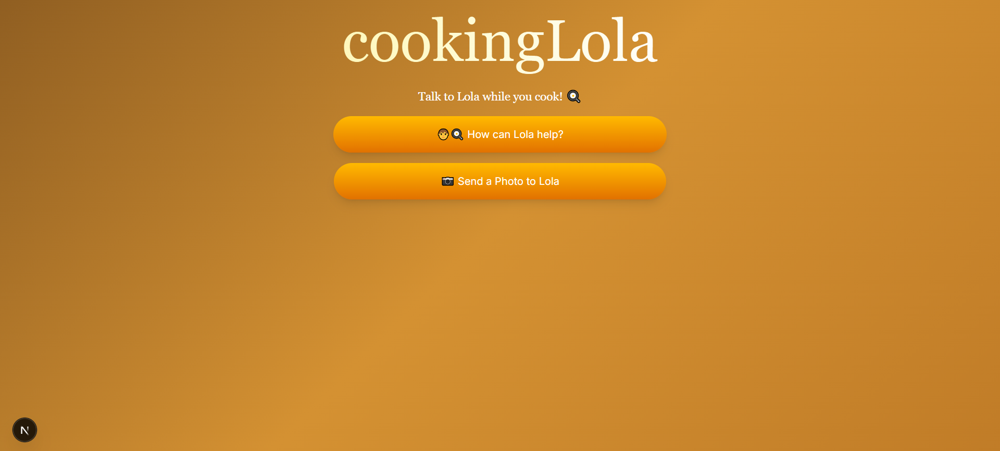
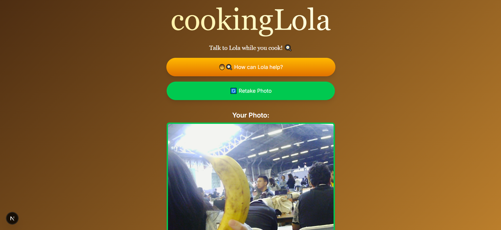

# CookingLola





---

## 🚀 Installation Instructions

### Clone the repository
```bash
git clone https://github.com/POEcm/calhacks12.git
```

### 🐍 Backend: Python Setup
```bash
python -m venv venv
.\venv\Scripts\activate
pip install -r requirements.txt
```

### Frontend: Next.JS Setup
```bash
npm install
```

## Run the servers - Dev mode

### Backend server
```bash
python app.py
```

### Frontend server
```bash
npm run dev
```